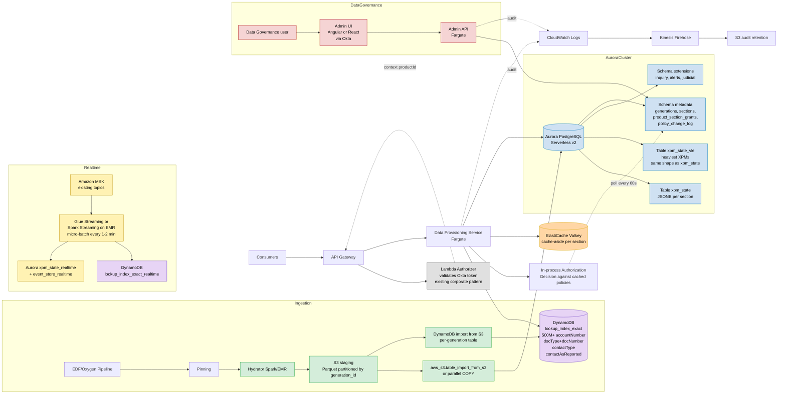
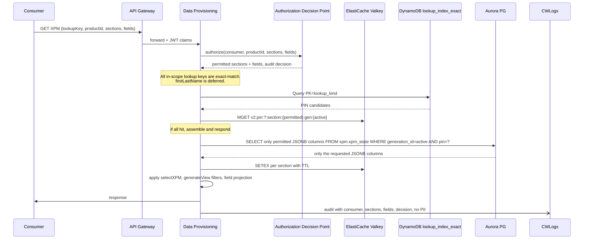
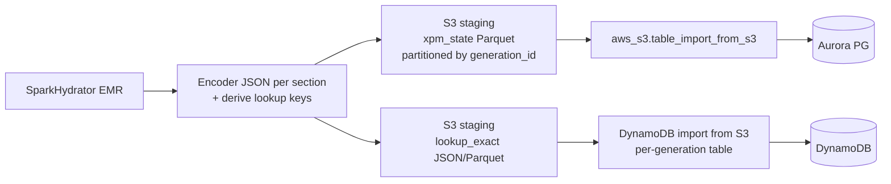
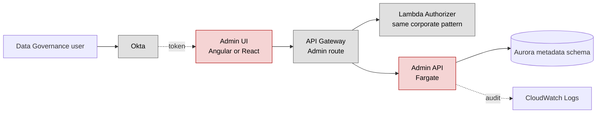
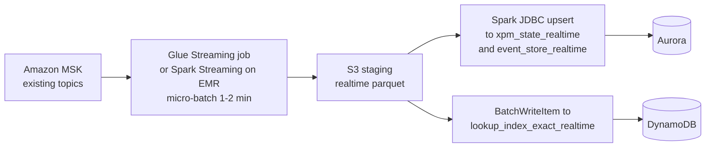

# Design — Option 3: Aurora PostgreSQL Serverless v2 with JSONB

## Purpose and Scope

This document is a deep dive into Option 3 from the architecture replanteamiento for the Data Provisioning redesign. It explores Aurora PostgreSQL Serverless v2 with JSONB sectorized columns as the candidate target System_Of_Record replacing HBase.

This document is one of the candidate target architectures evaluated in `decision-matrix.md`. It does not prescribe the final decision; it provides the depth needed to score Op3 with confidence and to plan validation spikes.

Out of scope for this design:

- Disaster recovery, multi-region replication and backup strategy (excluded by current replanteamiento directive).
- Items recorded in `000-contexto/open-questions.md`.
- Caching technology and granular authorization technology choices in detail. They are evaluated as transversal axes; this document only states how Op3 interacts with them.

## Inputs and Constraints Honored

This design honors:

- `000-contexto/architecture-steerings.md`: AWS managed/serverless preferred; no EKS or Cognito; Fargate for compute; ElastiCache Valkey as cache; encryption in transit and at rest; least-privilege IAM; PII/PHI/PCI never logged in clear; granular authorization auditable per request; "no more than two PII fields combined in audit logs" rule (queries and consumer responses are not restricted by this rule); Terraform for IaC; Markdown for documentation.
- `000-contexto/aws-approved-services.md`: Aurora is in the approved and preferred list.
- `000-contexto/current-problems.md`: dehydrate bottleneck, hotspot, Kerberos instability, lookup limitation, observability gaps.
- `000-contexto/data-model-context.md`: XPM model with ~30 sections, PIN as identifier, generation lifecycle, extension tables, Heavy PIN definition.
- `000-contexto/online-query-flow.md` and `000-contexto/ingestion-and-hydration-flow.md`: current online and offline flows.
- `000-contexto/current-costs.md`: cost baseline of approximately USD 25,692.64/month.

## Scale Assumption

Confirmed volumes for the active generation:

| Element | Confirmed value |
|---|---:|
| Total PINs in the system | 79,000,000 |
| XPM rows in `xpm_state` (active generation) | 73,000,000 |
| `xpm_state_vle` rows (heaviest XPMs, separate table) | ~730,000 (1% of `xpm_state`, confirmed by Project_Architect) |
| `accountNumber` lookups | 500,000,000 |
| `documentType + documentNumber` lookups | ~50,000,000 |
| `contactType` and `contactAsReported` lookups | ~200,000,000 |
| **Total exact-match lookups per generation** | **~750M** |
| Online ceiling at 12 months | 50 QPS sustained |

With 2 generations active per the retention model in `000-contexto/data-model-context.md`, the total exact-match lookup volume is around 1.5 billion rows. This volume is the reason all lookup keys are placed in DynamoDB, as detailed below.

**Deferred from this design**: queries by `firstLastName`. The fuzzy/typo-tolerant resolution of last names is excluded from the current scope. When it becomes in scope, a follow-up design will evaluate where to place it (an Aurora `lookup_index_fuzzy` with `pg_trgm`, an OpenSearch index if added to the approved list, or an alternative).

## Worst-Case Sizing Projection

Real per-section JSONB sizes can only be measured with a profiling spike on production data. Until that spike runs, this design is sized against a deliberately **conservative worst-case projection** so that ACU, storage, and HC-1 wall-time numbers are defensible.

### Assumptions used for the worst case

| Variable | Worst-case value | Justification |
|---|---:|---|
| Average XPM raw JSON size (normal PIN) | 200 KB | Generous upper bound; current observed averages are lower |
| Average Heavy PIN raw JSON size | 1.5 MB | Above the documented Heavy threshold of 500 KB and within the >1 MB observation |
| Heavy PIN proportion | 5% of `xpm_state` | Conservative; current Heavy proportion is reported lower |
| VLE PIN raw JSON size | 2.5 MB | **Assumption, pending Spike 2 measurement.** What is confirmed by Project_Architect is that VLE holds the heaviest XPMs and that `states-vle` has the same shape as `states-batch`; the actual average size for VLE PINs has not been measured. 2.5 MB is chosen as a conservative worst-case ceiling above the 1.5 MB Heavy average and consistent with the documented ">1 MB" observation for the heaviest PINs |
| VLE proportion | 1% of `xpm_state` | Confirmed by Project_Architect |
| LZ4 compression ratio for JSONB | 0.5 (worst case) | Real-world LZ4 on JSON typically 0.25 to 0.4; using 0.5 leaves headroom |
| Lookup item size (DynamoDB) | 200 B | Includes PK, SK, attributes, item overhead |
| Generations retained | 2 | Per `data-model-context.md` retention default |
| `frequent_behaviour` share of XPM | ~55% | Confirmed by Project_Architect; relevant for column-level read amplification savings |
| `best_accounts` (excluding `frequent_behaviour`) share | ~8% | Confirmed by Project_Architect |
| Remaining ~28 sections share | ~37% | Computed from the two confirmed values above |

### Aurora `xpm_state` worst-case storage

Per row, weighted average raw size:

```
0.94 * 200 KB  (normal PINs)            = 188.0 KB
0.05 * 1.5 MB  (Heavy PINs)             =  76.8 KB
0.01 * 2.5 MB  (VLE PINs, separate tbl) =  25.6 KB  (counted in xpm_state_vle below)

Weighted average for xpm_state (excl. VLE) ≈ 0.95 * 200 KB + 0.05 * 1.5 MB
                                            ≈ 190 KB + 75 KB = 265 KB raw / row
```

Compressed at 0.5 LZ4: ~132 KB/row.

```
xpm_state per generation:        73,000,000 rows × 132 KB = ~9.6 TB compressed
xpm_state_vle per generation:       730,000 rows × 1.25 MB = ~0.9 TB compressed
Total per generation:                                       = ~10.5 TB compressed
Total with 2 generations retained:                          = ~21 TB
```

### Aurora cluster volume worst-case

Aurora cluster volumes scale automatically. At ~21 TB of stored data:

- Storage cost (Aurora I/O-Optimized at $0.225/GB-month): **~$4,725/month**.
- Storage cost (Aurora Standard at $0.10/GB-month): **~$2,100/month**.

### DynamoDB `lookup_index_exact` worst-case storage

```
Per generation: 750,000,000 items × 200 B = ~150 GB
With 2 generations retained:               = ~300 GB
Cost at $0.25/GB-month:                    = ~$75/month storage
```

DynamoDB import-from-S3 cost worst-case:

```
Imported per generation: 150 GB × $0.15/GB = $22.50 per generation load
```

### What this means for the design

- The `xpm_state` storage projection is the dominant cost driver and the one most sensitive to compression ratio. Aurora I/O-Optimized adds about $2,600/month over Aurora Standard at this volume.
- Aurora Standard with provisioned IOPS may be cheaper if the read workload turns out to fit within a budget; this is a sizing decision to be confirmed in the spike.
- Heavy and VLE rows do not break the design: even at 2.5 MB raw, TOAST handles them and reads stay column-scoped.
- The cost numbers in the "Cost Estimation" section below are now expressed as a **worst-case ceiling**, not an average.

### Spike outputs that override these projections

The "Sample size and compression spike" must produce real values for:

1. JSONB raw size per section (mean, p95, p99, max).
2. LZ4 compression ratio per section.
3. Heavy PIN actual proportion.
4. Total `xpm_state` and `xpm_state_vle` storage projection.

If any of these values is materially better than the worst case (e.g., compression ratio 0.3 instead of 0.5), the design is reaffirmed with stronger margins. If any is materially worse, the storage line is updated and the C7 score in `decision-matrix.md` is revisited.

## Hard Constraints

These constraints are non-negotiable for this design and any spike that validates it.

| ID | Constraint | Source |
|---|---|---|
| HC-1 | Total Hydrator wall-clock time, end to end, must remain at most 5 hours per generation, equal to the current HBase-based pipeline | `000-contexto/ingestion-and-hydration-flow.md` and explicit business directive |
| HC-2 | Online p99 less than 1000 ms at 50 QPS sustained | `requirements.md` and `decision-matrix.md` C1 |
| HC-3 | Audit log entries must not contain more than two PII-classified fields combined in the same entry. This restriction applies to audit logs only; consumer requests and responses may contain more PII fields if the consumer is authorized | `000-contexto/architecture-steerings.md` steering 12, as clarified by the Project_Architect |

## Architecture Overview



Compute is Fargate. Encryption at rest and in transit by default with KMS. Terraform for all infrastructure. Per-request audit to CloudWatch Logs and Firehose to S3.

This is a hybrid storage design: Aurora is the System_Of_Record for XPM data; DynamoDB is the partner store for all lookup keys in scope (all are exact-match). Both stores are written from the same Hydrator pipeline and are kept consistent at generation activation time. The hybrid split is what allows the design to meet HC-1 (5-hour hydration window): Aurora absorbs ~73M XPM rows (plus ~730K VLE rows in a separate parallel import) per generation, and DynamoDB import-from-S3 handles the ~750M lookup rows in parallel without touching Aurora.

## Data Model

The data model has four logical layers: XPM state in Aurora (batch and realtime), VLE state in Aurora (heavy XPMs, same shape as batch), lookup index in DynamoDB (batch and realtime), event store in Aurora (realtime), and metadata in Aurora.

### XPM State Table

One row per (PIN, generation). Each XPM section is an independent JSONB column. This is what removes the dehydrate cost: there is no Avro+Snappy blob, only JSONB columns that PostgreSQL reads and decompresses individually.

```sql
CREATE TABLE xpm.xpm_state (
    pin                 BIGINT       NOT NULL,
    generation_id       INTEGER      NOT NULL,
    entity_type         SMALLINT     NOT NULL,  -- 1=person, 2=business
    -- XPM sections (~30 total; example of frequent ones)
    best_accounts       JSONB,
    frequent_behaviour  JSONB,
    best_identifications JSONB,
    chamber_of_commerce JSONB,
    -- ... ~26 additional sections
    last_updated        TIMESTAMPTZ NOT NULL DEFAULT now(),
    PRIMARY KEY (generation_id, pin)
) PARTITION BY LIST (generation_id);
```

Technical notes:

- `PRIMARY KEY (generation_id, pin)` with `PARTITION BY LIST (generation_id)`: partitions the table physically per generation. Cleanup of an archived generation is `DROP TABLE xpm.xpm_state_gen_N`, which is faster and operationally cleaner than the current HBase + S3 cleanup.
- TOAST is automatic in PostgreSQL: any JSONB column above approximately 2 KB is stored out of line with LZ4 compression (PG14+) or pglz. When a query does not select a column, PostgreSQL does not touch its TOAST data. This is the property that replaces the Avro+Snappy decompression of the entire blob.
- JSONB is binary on disk. There is no equivalent to the "Avro deserialize" step. The client only materializes what is selected.

#### Why `frequent_behaviour` is a top-level column

Logically, `frequent_behaviour` is a subsection inside `bestAccounts`. In the current XPM contract a consumer that asks for "bestAccounts" gets `frequent_behaviour` nested inside it. **In this storage model, however, `frequent_behaviour` is stored as its own top-level JSONB column**, not nested inside `best_accounts`. The reason is the size distribution confirmed by the Project_Architect:

| Scope | Share of total XPM weight |
|---|---:|
| `frequent_behaviour` (subsection) | ~55% |
| `best_accounts` (excluding `frequent_behaviour`) | ~8% |
| `best_accounts` + `frequent_behaviour` together | ~63% |
| Remaining ~28 sections combined | ~37% |

If `frequent_behaviour` were nested inside `best_accounts`, every query that asks for `bestAccounts` would pay the cost of reading and decompressing the heaviest 55% of the XPM, even when only the account header data is needed. Storing `frequent_behaviour` as a separate top-level column lets PostgreSQL skip the TOAST of `frequent_behaviour` when a query selects only `best_accounts`, which is the dominant access pattern according to current usage.

The DPS reassembles the consumer-facing shape (re-nesting `frequent_behaviour` under `bestAccounts`) after the read, on a much smaller projected object. The reassembly cost is microseconds compared to the savings of skipping ~55% of the row's storage scan on every miss.

This split is also why the Hydrator emits ~31 JSONB columns (not 30): the ~30 sections plus `frequent_behaviour` as its own column.

### VLE State Table

VLE corresponds to the heaviest XPMs in the system (~1% of total per Project_Architect clarification). Per the same source, the VLE table has the same structure and behavior as `xpm_state` (the batch state). It is kept as a separate physical table so that operations against VLE rows (which are heavier and may have different access patterns) do not contend with the rest of `xpm_state` for buffer cache, autovacuum, or maintenance windows.

```sql
CREATE TABLE xpm.xpm_state_vle (
    pin                 BIGINT       NOT NULL,
    generation_id       INTEGER      NOT NULL,
    entity_type         SMALLINT     NOT NULL,
    best_accounts       JSONB,
    frequent_behaviour  JSONB,
    best_identifications JSONB,
    chamber_of_commerce JSONB,
    -- ... same ~30 sections as xpm_state
    last_updated        TIMESTAMPTZ NOT NULL DEFAULT now(),
    PRIMARY KEY (generation_id, pin)
) PARTITION BY LIST (generation_id);
```

Notes:

- Same JSONB-per-section shape, same partitioning by `generation_id`, same retention rules.
- Service code resolves which table to read by request type or by a flag on the PIN's identity record. The current contract from `data-model-context.md` (VLE used for the VLE request type) is preserved.
- TOAST plus LZ4 still apply; Heavy XPMs in VLE are read column-scoped just like in `xpm_state`.

### Lookup Index — DynamoDB

All in-scope lookup keys are exact-match: `accountNumber`, `documentType + documentNumber`, `contactType`, `contactAsReported`, plus future exact keys. Total volume of ~750M rows per generation (~1.5B with two generations) is the canonical DynamoDB workload: single-digit millisecond p99 reads, automatic partitioning, no index maintenance during ingestion.

`firstLastName` is **deferred** from this design. When it is brought back into scope, a follow-up design will decide where to place it.

#### `lookup_index_exact` in DynamoDB

```text
Table: lookup_index_exact_gen_N (one table per generation; alias swap on activation)
   alternative: single table with generation_id in SK and TTL on archived items

Partition key (PK):  lookup_kind#lookup_value
                     example: "ACCOUNT_NUMBER#1234567890"
Sort key (SK):       pin
                     example: 7450577532313184495

Attributes:
  pin             Number
  lookup_kind     String   (ACCOUNT_NUMBER | DOC_TYPE_NUM | CONTACT_TYPE | CONTACT_AS_REPORTED | ...)
  lookup_value    String
  confidence      Number   (optional, for near-neighbor cases)

Capacity mode:        On-demand (during hydration), provisioned with auto-scaling for steady state
Encryption:           AWS-owned KMS key by default; CMK if PCI scope requires it
Point-in-time recovery: out of scope per replanteamiento directive
```

Notes:

- Per-generation table is the recommended pattern: each new generation lands in its own table via DynamoDB import-from-S3, the application generation pointer is flipped at activation, and the archived generation's table is dropped at cleanup time. Cleanup is then O(1) and operationally trivial.
- The composite PK `lookup_kind#lookup_value` avoids hot partitions on common values. At 500M+ `accountNumber` keys, partition spread is naturally good.
- Multiple PIN candidates for the same lookup value are represented as multiple items sharing the PK and differing in SK (`pin`). This preserves the multi-candidate semantics of the current `pin-index` and `near-neighbor` resolution.
- Two consumer access patterns are supported:
  - `Query` by PK returns all PINs for that lookup value in the active generation.
  - `BatchGetItem` for batch lookups, when downstream features need it.

### Extension Tables

Per steering, extension tables remain logically separate. Dedicated schema:

```sql
CREATE SCHEMA extensions;

CREATE TABLE extensions.inquiry_footprints (
    doc_type        SMALLINT,
    doc_number      TEXT,
    payload         JSONB,
    last_updated    TIMESTAMPTZ NOT NULL DEFAULT now(),
    PRIMARY KEY (doc_type, doc_number)
);
-- same pattern for alerts, judicial_information
```

### Metadata

```sql
CREATE SCHEMA metadata;

CREATE TABLE metadata.generations (
    generation_id   INTEGER PRIMARY KEY,
    state           TEXT NOT NULL,  -- candidate | reference | active | archived
    activated_at    TIMESTAMPTZ,
    archived_at     TIMESTAMPTZ
);

CREATE TABLE metadata.section_catalog (
    section_name        TEXT PRIMARY KEY,
    classification      TEXT,        -- public | internal | restricted
    field_classification JSONB        -- { "fieldPath": "PII" | "PCI" | "NONE", ... }
);

CREATE TABLE metadata.product_section_grants (
    product_id      TEXT NOT NULL,
    section_name    TEXT NOT NULL,
    field_paths     TEXT[],          -- empty array means full section authorized
    PRIMARY KEY (product_id, section_name)
);

-- Catalog version, bumped on every change. The DPS in-process cache reads it
-- once per poll and reloads policies only when the version has changed.
CREATE TABLE metadata.policy_version (
    singleton       BOOLEAN PRIMARY KEY DEFAULT TRUE,
    version         BIGINT NOT NULL,
    updated_at      TIMESTAMPTZ NOT NULL DEFAULT now(),
    CHECK (singleton = TRUE)
);

-- Audit trail for Data Governance changes to the catalog and grants.
CREATE TABLE metadata.policy_change_log (
    change_id       BIGSERIAL PRIMARY KEY,
    changed_at      TIMESTAMPTZ NOT NULL DEFAULT now(),
    actor           TEXT NOT NULL,            -- Okta sub of the Data Governance user
    table_name      TEXT NOT NULL,            -- 'section_catalog' | 'product_section_grants'
    operation       TEXT NOT NULL,            -- 'INSERT' | 'UPDATE' | 'DELETE'
    primary_key     JSONB NOT NULL,
    old_value       JSONB,
    new_value       JSONB
);
```

## Online Query Flow



Key differences versus the current flow:

- `pinResolution` becomes a single DynamoDB `Query` with single-digit ms p99 by design, for every in-scope lookup key.
- `fetchXPM` goes from `Get HBase + Snappy + Avro + JsonNode` (~1,627 ms for Heavy PIN) to `SELECT col1, col2, col3 FROM xpm_state WHERE pin = ?`. For non-requested columns, PostgreSQL does not touch TOAST. For Heavy PIN, only the LZ4 of the requested columns is read and decompressed.
- `generateView` filters mostly become `jsonb_set` or `jsonb_path_query` evaluated in SQL, or stay in service code but operate on much smaller objects (only the requested sections).
- Extension tables remain parallel reads but are now simple `SELECT` by primary key in Aurora.

## Hydrator Migration

This is the most expensive part of the change and the section most exposed to the 5-hour wall-clock constraint (HC-1). Today the Hydrator does `JSON → Avro → Snappy → HFile → BulkLoad`. The final sink must be replaced and split across two stores while keeping total wall time at most 5 hours.

The Hydrator must produce, per generation:

- One write stream into Aurora `xpm_state` (sections as JSONB columns), 73M rows.
- One write stream into Aurora `xpm_state_vle` (heaviest XPMs, same shape as `xpm_state`), 730K rows.
- One write stream into DynamoDB `lookup_index_exact` (`accountNumber`, `documentType+documentNumber`, `contactType`, `contactAsReported`, future exact keys), ~750M items.

All three streams are derived from the same Spark transformation and run in parallel. None modifies Oxygen or EDF core stages (steering 4).

### Wall-clock budget under HC-1 — worst-case projection

The 5-hour constraint is honored because the design avoids serial work in Aurora at lookup-index volume. The budget below is computed against the **worst-case sizing projection** (73M XPM rows + 730K VLE rows, 0.5 LZ4 ratio, ~10.5 TB compressed per generation, 750M lookup items / ~150 GB).

| Phase | Worst-case wall time | Runs in parallel with |
|---|---:|---|
| Spark transform + write Parquet to S3 (xpm_state, xpm_state_vle, lookup_exact) | ~2.5 h | none (precondition) |
| `aws_s3.table_import_from_s3` into Aurora `xpm_state_gen_N` (73M rows, JSONB+LZ4, ~9.6 TB) | ~3.5 h | DynamoDB import + VLE import |
| `aws_s3.table_import_from_s3` into Aurora `xpm_state_vle_gen_N` (730K rows, ~0.9 TB) | ~0.5 h | xpm_state import + DynamoDB import |
| DynamoDB import-from-S3 into `lookup_index_exact_gen_N` (750M items, ~150 GB) | ~2.5 h | Aurora imports |
| Smoke validation + generation activation | ~0.3 h | none |
| **Total wall-clock (Spark → max(parallel imports) → activation)** | **~2.5 h + 3.5 h + 0.3 h ≈ 6.3 h** | **exceeds HC-1 5 h budget under worst case** |

Honest assessment: under the worst-case sizing, the budget is exceeded by approximately 1.3 hours, driven by the Aurora `xpm_state` import. This does **not** mean the design fails; it means the worst-case projection requires the mitigations below, and that the spike must measure the real number.

The realistic case is significantly better:

- Spike-measured LZ4 ratio is typically 0.3 instead of 0.5, which drops Aurora storage from ~9.6 TB to ~5.8 TB and the import phase from ~3.5 h to ~2.1 h.
- Spike-measured Heavy proportion is typically lower than 5%.
- Spark transform time today is bounded by what already runs; the 2.5 h estimate is conservative.

Realistic-case budget is approximately:

| Phase | Realistic wall time |
|---|---:|
| Spark transform + write Parquet to S3 | ~2.0 h |
| Aurora `xpm_state` import (with 0.3 LZ4 ratio) | ~2.1 h |
| Aurora `xpm_state_vle` import | ~0.3 h |
| DynamoDB lookup import | ~2.5 h |
| Smoke validation + activation | ~0.3 h |
| **Total wall-clock** | **~2.0 h + 2.5 h + 0.3 h ≈ 4.8 h** |

Notes:

- DynamoDB import-from-S3 is fully managed and does not consume write capacity. AWS publishes throughput sufficient for 150 GB in 2 to 3 hours; this is the load-bearing assumption of HC-1 and must be validated in the spike.
- Aurora `aws_s3.table_import_from_s3` runs in parallel with the DynamoDB import because they target different services.
- The Spark transform itself is unchanged in CPU profile vs today: same data, different output format. Total Spark time is bounded by what already runs in production today.
- The Aurora import is the binding constraint under worst case. The HC-1 abort criteria below describe the mitigations that bring it under 5 hours if the spike confirms the worst-case storage line.

### Path A — Spark to S3 to Aurora and DynamoDB bulk import (recommended)



Recommended mechanism for the DynamoDB load at 750M rows per generation:

- **DynamoDB import from S3 (managed)**: writes a fresh per-generation table from S3 in one shot. The new generation lands in `lookup_index_exact_gen_N`, generation activation flips the alias the service reads from, and the previous generation's table is dropped at cleanup. Cost is per GB imported; no write-capacity charge.

`Step Functions + parallel BatchWriteItem` is reserved for incremental delta updates (e.g., a future realtime path), not for full-generation loads, because it consumes write capacity and would not fit the 5-hour budget at 750M items.

### Path B — Spark JDBC + Spark DynamoDB connector (fallback)

Spark JDBC (`COPY`) for Aurora; Spark DynamoDB connector (`emr-dynamodb-connector` or AWS-provided) for the exact lookup. Operationally simpler in some respects but typically slower at this volume; documented as a fallback only if the spike shows that import-from-S3 cannot meet HC-1.

### Honest Trade-off

- HBase BulkLoad is one of the fastest load mechanisms in the ecosystem. Aurora and DynamoDB combined do not match it on raw throughput per service, but the design parallelizes across two services so the wall time is bounded by the slower of the two imports rather than by their sum.
- The hybrid split is the reason HC-1 is achievable: Aurora absorbs ~73M XPM rows (plus ~730K VLE rows in a separate parallel import); DynamoDB absorbs ~750M lookup items via managed import-from-S3 in parallel.
- Mitigations: scale Aurora ACUs only during the hydration window; pre-partition Aurora `xpm_state` by generation; use DynamoDB import-from-S3 for full-generation loads exclusively; size the DynamoDB import job parallelism explicitly during the spike.

### HC-1 abort criteria

If the Hydrator hybrid sink spike measures total wall time greater than 5 hours, this design **fails HC-1**. Mitigations to evaluate before declaring failure:

1. Run the Spark transform and the imports in true parallel by separating output Parquet writes per sink so the imports can start while Spark is still producing later partitions.
2. Use Aurora I/O-Optimized to remove I/O variance during `aws_s3.table_import_from_s3`.
3. Increase Spark cluster size during the transform phase only (does not affect import phase since DynamoDB import is managed).
4. Reduce the per-row payload of `lookup_index_exact` items to the minimum needed (no `lookup_value` echo if PK encoding suffices) to shrink the imported GB.

If none of the above brings wall time under 5 hours, this design is rejected and a different lookup placement strategy must be evaluated.

### Generation Activation

Activation must be atomic across both stores. The pattern is:

```sql
-- Aurora: attach the new partition for xpm_state
BEGIN;
  ALTER TABLE xpm.xpm_state ATTACH PARTITION xpm.xpm_state_gen_N FOR VALUES IN (N);
  UPDATE metadata.generations SET state='archived', archived_at=now() WHERE state='active';
  UPDATE metadata.generations SET state='active', activated_at=now()  WHERE generation_id=N;
COMMIT;
```

```text
DynamoDB: flip the application-level alias
  generation_pointer (in DynamoDB or Aurora metadata) is updated atomically
  to point to lookup_index_exact_gen_N. Subsequent reads use the new generation.
```

Activation atomicity is achieved by reading the active generation pointer at request time. While Aurora's `COMMIT` and DynamoDB's pointer update are not a single distributed transaction, the application reads the generation pointer once and uses it for both stores within the request, giving read-your-writes semantics for the consumer.

Cleanup of an archived generation:

```sql
-- Aurora
DROP TABLE xpm.xpm_state_gen_N;
```

```text
DynamoDB: drop the per-generation table lookup_index_exact_gen_N.
S3: lifecycle rule purges Parquet staging older than the documented retention.
```

Cleaner than the current HBase + S3 cleanup.

### Generation Pointer — Trade-off Analysis

The "active generation" must be readable atomically by Data Provisioning to keep Aurora and DynamoDB consistent within a request. Two viable placements were considered.

#### Option A — Generation pointer in Aurora `metadata.generations` (recommended)

The `state='active'` row in `metadata.generations` is the single source of truth. Data Provisioning reads it once at the start of each request and uses the same value for both stores.

Pros:

- Activation happens **inside** the same SQL transaction that attaches the new partition to `xpm_state`. This guarantees that no consumer ever sees a state where the partition is attached but the pointer is not, or vice versa.
- One source of truth, no synchronization between two pointer stores.
- Read of the pointer benefits from Aurora connection pool already used by the service.

Cons:

- Adds one Aurora round-trip per request to read the pointer. Mitigated by caching the pointer in service memory with short TTL (e.g., 5 to 10 seconds) and by listening to a logical replication slot or polling for changes.
- If Aurora is unavailable, the entire request path is blocked even if the data the consumer needs lives in DynamoDB. In practice this is acceptable because Aurora is required on the read path for the XPM itself.

#### Option B — Generation pointer in AWS Systems Manager Parameter Store or DynamoDB

A small auxiliary store holds the pointer. Both Aurora and DynamoDB lookups read the same value.

Pros:

- Pointer read can be cached aggressively at the service level with low risk.
- Decouples pointer reads from Aurora availability; Aurora outages do not propagate to the pointer.

Cons:

- Activation atomicity now spans two systems: the Aurora `ATTACH PARTITION` transaction must be coordinated with a separate write to Parameter Store or DynamoDB. There is a brief window during the swap where the two stores can disagree.
- Two sources of truth to keep consistent. Operationally heavier; more failure modes during cutover.
- The window of inconsistency is bounded but real, and must be documented in the runbook.

#### Decision

This design adopts **Option A** as the recommended placement: the generation pointer lives in `metadata.generations` in Aurora, read once per request and cached briefly in service memory.

The rationale is that Aurora is on the read path anyway (the XPM lives there), so the perceived "extra dependency" is not actually added. The atomicity benefit during activation is real and removes a class of failure that Option B would carry. Option B remains viable as a fallback if operational evidence shows that pointer reads add unacceptable latency or coupling; in that case, the cache TTL on the service side can also be tuned upward as a less invasive alternative.

### High Availability — Multi-AZ Intra-Region

While disaster recovery and multi-region replication are out of scope, intra-region HA is part of this design because Aurora Serverless v2 without Multi-AZ has failover windows that can violate HC-2 (p99 < 1000 ms).

#### Aurora cluster topology

```
Region: us-east-1 (current production region)

Aurora PG Serverless v2 cluster
  Writer instance      AZ1   (Serverless v2, 0.5–8 ACU)
  Reader instance 1    AZ2   (Serverless v2, 0.5–8 ACU)
  Reader instance 2    AZ3   (Serverless v2, 0.5–8 ACU)

Cluster endpoint        — for writes
Reader endpoint         — for online read traffic (load-balanced across readers)
```

Notes:

- Aurora cluster volume is automatically replicated across 3 AZs in the same region (built-in for any Aurora deployment); only the compute instances need explicit Multi-AZ provisioning.
- Failover from writer to a reader takes seconds (not minutes), driven by Aurora's managed failover mechanism. This stays within HC-2.
- Online read traffic uses the reader endpoint, isolating the writer instance from query load. Hydrator imports use the writer endpoint, scoped to the hydration window.

#### DynamoDB

DynamoDB is Multi-AZ by default within a region; no additional configuration required for intra-region HA.

#### ElastiCache Valkey

Two nodes in two AZs (1 primary plus 1 replica) covers intra-region HA for the cache layer. Promotion on AZ failure is automatic.

#### Cost impact

Multi-AZ adds the cost of additional reader instances and cache replica. This is reflected in the worst-case cost projection below.

### Aurora Connectivity — Secrets Manager and RDS Proxy

This subsection covers the two connectivity decisions for Aurora that affect the read path and the write path: how the DPS, the Hydrator, and the Admin API authenticate against Aurora, and whether RDS Proxy sits in front of the cluster.

#### Authentication: AWS Secrets Manager with rotation

Aurora authentication uses **AWS Secrets Manager with automatic rotation**. IAM database authentication is documented as a viable alternative but not the chosen one for this design.

Rationale:

- Secrets Manager is the corporate-friendly path: rotation is a managed feature, the rotation schedule is auditable, and access to the secret is governed by IAM policies that fit the least-privilege model.
- IAM database authentication has lower setup cost per connection, but the 15-minute token expiration adds reconnection overhead under steady traffic and complicates Hydrator long-running jobs.
- Secrets Manager works cleanly with RDS Proxy (described below): the proxy fetches the secret and presents the credentials to clients without rotation tax on the application code.

Configuration:

| Parameter | Value |
|---|---|
| Secret store | AWS Secrets Manager |
| Rotation function | AWS-managed Lambda rotation function for Aurora PostgreSQL |
| Rotation interval | 30 days |
| Rotation strategy | Single-user rotation with master/secondary credential pattern; the rotation Lambda alternates between two users to avoid downtime |
| Encryption | Customer Managed Key (CMK) in AWS KMS |
| Access control | IAM policy granting `secretsmanager:GetSecretValue` only to the specific roles (DPS task role, Hydrator import role, Admin API role) |
| Audit | CloudTrail records every secret retrieval |

Operational notes:

- Rotation events are emitted to CloudWatch and visible in the Admin UI's audit context (read-only).
- The DPS task and the Admin API task pick up rotated credentials by re-fetching the secret on connection failure or via short-TTL caching (60 seconds).
- The Hydrator picks up the secret at job start; long-running Spark stages are not affected by mid-job rotation because Aurora keeps both the old and new credential active during the rotation window.

#### RDS Proxy — When to enable, when to skip

RDS Proxy sits between the application and Aurora. It manages a connection pool, multiplexes client connections onto a smaller number of database connections, and integrates with Secrets Manager so the application never sees the credentials directly. **At 50 QPS sustained (the documented ceiling at 12 months), RDS Proxy is recommended for this design.** The trade-off below documents the threshold at which it stops being necessary.

##### Trade-off at 50 QPS sustained

Under the documented HC-2 (p99 < 1000 ms at 50 QPS sustained) and the design's Multi-AZ topology (1 writer + 2 readers), the connection profile is approximately:

| Source | Estimated concurrent connections |
|---|---:|
| DPS Fargate tasks (e.g., 6 tasks × 20 connections each) | ~120 |
| Realtime micro-batch (Glue Streaming, 1 job × ~20 connections) | ~20 |
| Hydrator (during hydration window only, 1 Spark job × ~50 connections) | ~50 |
| Admin API (low traffic) | ~5 |
| **Total at 50 QPS sustained** | **~145 connections (online) + ~50 spike during hydration** |

Aurora Serverless v2 at 8 ACU sustains roughly 1,000 connections per ACU (PostgreSQL `max_connections` scales with instance size), so the absolute number is well within capacity. The risk at 50 QPS is **not** running out of connections but rather:

- Connection churn under task scaling (Fargate auto-scales, each new task opens a fresh pool).
- Connection storms after AZ failover or Aurora restart.
- Aurora Serverless v2 scaling events can drop connections briefly; client-side handling of this is non-trivial.

RDS Proxy mitigates these three risks with documented behaviors: connection pinning, idle connection reaping, and automatic failover transparent to the client.

| Aspect | Without RDS Proxy | With RDS Proxy |
|---|---|---|
| Latency added per request | 0 ms | ~1–3 ms |
| Connection churn under task scaling | High; each new Fargate task opens its own pool | Low; the proxy holds a stable pool |
| Behavior after AZ failover | Client-side reconnection logic (must be robust); a few seconds of errors | Transparent to client; pinning means the proxy reconnects to the new writer |
| Behavior during Aurora Serverless v2 scaling | Possible brief disconnects; the application must handle them | Mitigated; the proxy holds the connection while Aurora scales |
| Setup complexity | Simple | One additional resource to provision and monitor |
| Cost | None beyond Aurora itself | Approximately USD 0.015 per ACU per hour for the proxy compute |
| Secrets Manager integration | Application reads the secret directly | The proxy reads the secret and presents credentials to the client (cleaner separation) |

##### Decision threshold by QPS

The proxy adds ~1–3 ms per request. At 50 QPS sustained with HC-2 of p99 < 1000 ms, this is comfortably within budget. As QPS grows the connection-management benefit dominates the latency cost, so the recommendation grows stronger. As QPS shrinks, the latency cost dominates and the proxy stops being justified.

| QPS sustained | RDS Proxy recommendation | Rationale |
|---|---|---|
| < 10 QPS | Optional, not required | Connection volume is low, churn risk is minimal, the latency overhead is not justified |
| 10 to 30 QPS | Optional, recommended only if the application needs failover transparency or if Fargate auto-scales aggressively | Connection storms during scaling are the main risk |
| 30 to 100 QPS | **Recommended** (this design's range) | Connection management benefit clearly dominates the latency cost |
| > 100 QPS | Strongly recommended | Without the proxy, connection storms during failover or scaling become disruptive |

The cut-off **30 QPS** is approximate. It assumes Fargate task auto-scaling that opens 3–5 new connections per task on cold start. If the deployment uses fewer tasks (vertical scaling rather than horizontal), the threshold moves up; if more tasks, it moves down.

##### Configuration if enabled

| Parameter | Value |
|---|---|
| Endpoint type | One per cluster role: writer endpoint and reader endpoint |
| Engine family | PostgreSQL |
| Authentication | IAM (proxy fetches the Secrets Manager secret on behalf of the client) |
| TLS | Required end-to-end |
| Idle connection timeout | 5 minutes |
| Connection borrow timeout | 120 seconds |
| Session pinning filters | Default plus `EXCLUDE_VARIABLE_SETS` to allow `SET LOCAL app.product_id` for RLS without forcing pinning |
| Multi-AZ | Yes, in the same 3 AZs as the Aurora cluster |
| Cost | ~USD 0.015 per ACU per hour, ~USD 11/month per ACU minimum, scales with traffic |

##### Decision recorded

For this design at 50 QPS sustained:

- **Enable RDS Proxy** in front of Aurora for both writer and reader endpoints.
- **Authenticate via Secrets Manager with rotation**, with the proxy holding the secret.
- The DPS, Realtime job, Hydrator, and Admin API all connect through the proxy.
- Reconsider this decision if the steady-state QPS measured in production is consistently below 30 QPS for at least 6 months; in that case the proxy can be removed without changing the application code (the application still reads the same Secrets Manager secret if direct connection is restored).

##### Cost impact

RDS Proxy cost at 50 QPS sustained is approximately:

- Low usage (1–2 ACU on the proxy): ~USD 22–44/month.
- High usage at 50 QPS (4–6 ACU on the proxy): ~USD 88–132/month.

This is captured in the Cost Estimation section under Aurora compute.

## Hydrator Detailed Changes

This section details what the `oxygen-hydrator` codebase needs to change in Op3. It is meant as a starting input for the implementation team, not a final implementation plan.

### What does NOT change

The Hydrator stays Spark/Scala on EMR. The Airflow orchestration, the upstream pipeline phases (Preparation → Validation → Acceptance → Curation → Pinning), and the generation lifecycle model are intact. The five Hydrator phases remain as logical units, although some consolidate their output into fewer sinks.

| Element | State |
|---|---|
| Repository `oxygen-hydrator` | Same |
| Stack Scala + Apache Spark + EMR | Same |
| Airflow DAGs and orchestration | Same |
| `SparkHydrator.scala` (entry point) | Same |
| `SparkHydratorController.scala` | Same (sink selection changes) |
| Input read from S3/HDFS | Same |
| Per-phase transformation logic | Same (same state, synthesis, indexing computations) |
| Generation model (active/reference/archived) | Same |
| Coexistence of up to 7 generations, default retention 2 | Same |

The Spark transformation core does not change. **Only the final sink changes**: instead of `Avro → Snappy → HFile → BulkLoad`, the job now produces Parquet on S3 and triggers two managed imports against Aurora and DynamoDB.

### Phase-by-phase changes

#### HydratorStampedIdentity, HydratorPinIndex, HydratorNearNeighbor

Today these three phases write to three separate HBase tables (`stamped-identity-batch`, `pin-index-batch`, `near-neighbor-batch`) with HFile BulkLoad, each with its own Avro encoder and schema.

In Op3 they consolidate into a **single logical lookup index** in DynamoDB. From the read path's perspective, all three phases produce the same shape: "a lookup key → one or more PIN candidates".

Changes:

- Each phase stops generating HFiles. Instead, it writes JSON or Parquet records to S3 with the shape DynamoDB import-from-S3 expects:

  ```text
  {
    "pin_lookup_kind": { "S": "DOC_TYPE_NUM" },
    "pin": { "N": "7450577532313184495" },
    "lookup_value": { "S": "1_123456789" },
    "confidence": { "N": "100" }
  }
  ```

- The three phases write to distinct S3 staging prefixes (one per `lookup_kind`), but all end up imported into a single DynamoDB table `lookup_index_exact_gen_N`.
- The `lookup_kind` is derived from the logical name of the phase: `DOC_TYPE_NUM` for StampedIdentity and PinIndex, `NEAR_NEIGHBOR` for NearNeighbor (or the more specific kinds like `ACCOUNT_NUMBER`, `CONTACT_TYPE` when the upstream data supports it).
- The job's final step (after the three phases) is a single `DynamoDB import-from-S3` that creates `lookup_index_exact_gen_N` from the unified set of staged S3 files.

This consolidation reduces operational complexity: today 3 HBase tables maintained separately; in Op3, 3 S3 prefixes import into 1 DynamoDB table.

#### HydratorSynthesis

Today it writes to `synthetic-events-batch` in HBase as BulkLoad.

In Op3 it is no longer persisted as a standalone serving table. Synthetic events are **input for HydratorStateCalc**, not an output for the read path. They materialize as Parquet in S3 staging and are read directly by the StateCalc phase.

If operationally needed for debugging, audit or replay, the Parquet files stay in S3 with a per-generation lifecycle. They do not land in Aurora or DynamoDB.

#### HydratorStateCalc

Today it writes the full XPM as an Avro+Snappy blob to `states-batch` in HBase, RowKey = PIN.

In Op3 it produces **two Aurora sinks** instead of one:

- `xpm_state_gen_N` for the normal PINs (~73M rows).
- `xpm_state_vle_gen_N` for the heaviest XPMs (~730K rows, the top 1%).

The routing logic (which PIN goes where) comes from `entity_type` or the existing flag in the model that already distinguishes VLE PINs.

The key technical change is that **a single JSONB blob is replaced by ~30 JSONB columns**, one per section. The Spark job stops doing:

```text
Object → AvroEncoder → SnappyCompressor → HFileWriter → BulkLoad
```

and starts doing:

```text
Object → split by section → DataFrame with ~30 JSONB columns → write Parquet to S3 → aws_s3.table_import_from_s3
```

Each PIN becomes a Parquet row with columns `(pin, generation_id, entity_type, best_accounts_json, frequent_behaviour_json, best_identifications_json, ...)`. Aurora's `aws_s3.table_import_from_s3` consumes that Parquet and loads it into `xpm_state_gen_N` with all JSONB columns in a single operation.

### Components removed

These files/classes lose their use case and are removed or become dead code:

| Component | Reason for removal |
|---|---|
| `SparkHbaseBulkLoadHydratorRepository.scala` | No more BulkLoad, no more HFiles |
| `SparkAvroEncoder.scala` | No more Avro serialization; Aurora reads JSONB natively |
| `SnappyCompressor.scala` | No more Snappy; Aurora applies LZ4 automatically via TOAST |
| `HBaseTableRegionCalculator.scala` | No HBase regions to size |
| `HbaseAvroSchemaRepository.scala` | No Avro schemas stored in HBase; JSONB columns are schema-on-read |
| `HbaseHydratorServiceConfig.scala` | Replaced by configuration of the two new sinks |
| `SparkHbaseHydratorService.scala` | Replaced by two new services (one per sink) |

The deleted code footprint is significant: roughly the entire HBase write module. The transformation core (state computation, synthesis, indexing) is preserved.

### Components added

These are new components in the repository:

#### `SparkAuroraSinkService.scala`

Takes a `DataFrame` with the JSONB columns and writes it to S3 as Parquet in the structure expected by Aurora `aws_s3.table_import_from_s3`. Responsibilities:

- Partition output by `generation_id` (so Aurora receives it directly into the correct partition).
- Write Parquet with compression (gzip or zstd) to speed up the upload to Aurora.
- Trigger `aws_s3.table_import_from_s3` against Aurora over JDBC at the end of the job.
- Retry and monitoring of the import status (Aurora reports progress via `aws_s3.query_export_status`).

It has two distinct invocations:

- One for `xpm_state_gen_N`.
- One for `xpm_state_vle_gen_N`.

#### `SparkDynamoDbSinkService.scala`

Counterpart for DynamoDB. Responsibilities:

- Write JSON records in DynamoDB AWS format (`{"AttributeName":{"Type":"Value"}}`) to S3.
- Partition by `lookup_kind` to ease debugging and operations.
- Trigger `aws-cli dynamodb import-table` at the end of the job to create `lookup_index_exact_gen_N` from S3.
- Poll the import job status until `COMPLETED` or `FAILED`.

#### `JsonbColumnEncoder.scala`

Small component that takes an object from the computed state and expands it into ~30 JSONB string values ready for Parquet. This is where the "blob → one-column-per-section" split happens.

#### `GenerationActivationCoordinator.scala`

Orchestrates the final activation step: SQL transaction against Aurora (`ATTACH PARTITION`, `UPDATE metadata.generations`) and the alias swap in DynamoDB (the DPS reads `metadata.generations` to know the active generation). Replaces the current "activate HBase generation" logic.

#### New configuration

Replaces `HbaseHydratorServiceConfig.scala`:

```yaml
hydrator:
  aurora:
    cluster-endpoint: "..."
    iam-role-arn: "arn:aws:iam::...:role/HydratorAuroraImportRole"
    schema: "xpm"
    xpm-state-table: "xpm_state"
    xpm-state-vle-table: "xpm_state_vle"
    metadata-schema: "metadata"
  dynamodb:
    region: "us-east-1"
    iam-role-arn: "arn:aws:iam::...:role/HydratorDynamoImportRole"
    table-prefix: "lookup_index_exact_gen_"
  s3-staging:
    bucket: "experian-hydrator-staging-us-east-1"
    prefix-xpm-state: "xpm-state/gen-{N}/"
    prefix-xpm-state-vle: "xpm-state-vle/gen-{N}/"
    prefix-lookup-exact: "lookup-exact/gen-{N}/"
```

### Schema and serialization changes

| Today | In Op3 |
|---|---|
| Avro schema stored in S3 + HBase | No Avro; JSONB columns are schema-on-read |
| Snappy compression | Replaced by LZ4 via TOAST in Aurora; gzip/zstd in Parquet staging |
| HFile binary format | Parquet on S3 staging |
| Single column `cf:q` with full XPM | ~30 JSONB columns in `xpm_state` |
| RowKey = PIN | PRIMARY KEY = `(generation_id, pin)` in Aurora; PK = `lookup_kind#lookup_value`, SK = `pin` in DynamoDB |
| Schema evolution via Avro versioning | Schema evolution via `ALTER TABLE ADD COLUMN` in Aurora; new keys in DynamoDB do not require schema change |

Removing Avro+Snappy takes out a whole serialization layer. This simplifies debugging (the content is human-readable JSON at every pipeline step) but requires care in the Spark job to ensure the produced JSON is valid and consistent.

### Generation activation change

Today activation is a multi-step logical process against HBase + S3 (move pointers, validate checks). In Op3:

```sql
BEGIN;
  ALTER TABLE xpm.xpm_state ATTACH PARTITION xpm.xpm_state_gen_N FOR VALUES IN (N);
  ALTER TABLE xpm.xpm_state_vle ATTACH PARTITION xpm.xpm_state_vle_gen_N FOR VALUES IN (N);
  UPDATE metadata.generations SET state='archived', archived_at=now() WHERE state='active';
  UPDATE metadata.generations SET state='active', activated_at=now()  WHERE generation_id=N;
COMMIT;
```

DynamoDB activation is the alias swap (`active_generation` in `metadata.generations`, read by the DPS).

`GenerationActivationCoordinator.scala` orchestrates both steps. Aurora activation is **atomic** (single SQL transaction) and propagates to DynamoDB with read-your-writes from the DPS because both systems read the same pointer.

Cleanup of an archived generation:

```sql
DROP TABLE xpm.xpm_state_gen_(N-2);
DROP TABLE xpm.xpm_state_vle_gen_(N-2);
```

```bash
aws dynamodb delete-table --table-name lookup_index_exact_gen_(N-2)
```

This replaces the current cleanup that requires deleting HBase regions plus S3 objects.

### Wall-clock budget summary

The Hydrator wall-clock budget detailed in the Hydrator Migration section is summarized here for the implementation team:

| Phase | Worst-case | Realistic |
|---|---:|---:|
| Spark transform + Parquet to S3 | ~2.5 h | ~2.0 h |
| `aws_s3.table_import_from_s3` Aurora `xpm_state` | ~3.5 h | ~2.1 h |
| `aws_s3.table_import_from_s3` Aurora `xpm_state_vle` | ~0.5 h | ~0.3 h |
| DynamoDB import-from-S3 lookup | ~2.5 h | ~2.5 h |
| Smoke validation + activation | ~0.3 h | ~0.3 h |
| **Total (Spark → max(parallel imports) → activation)** | **~6.3 h** | **~4.8 h** |

The realistic-case budget meets HC-1; the worst-case exceeds it by ~1.3 h. If the spike confirms worst-case without mitigations applying, four mitigations are documented in the HC-1 abort criteria. If those do not bring the wall time under 5 hours, the design is rejected.

### Operating during migration

For 2 to 4 months, the Hydrator runs in **dual-write** mode: it produces both the current HFiles for HBase **and** the Parquets and imports for Aurora + DynamoDB. This requires:

- Keeping `SparkHbaseBulkLoadHydratorRepository.scala` active during the migration window (not removed until cutover).
- A configuration flag to enable/disable each sink.
- A parity job (new Spark job that compares a sample of PINs between HBase and Aurora, reports divergences).
- CloudWatch metrics monitoring divergence, throughput per sink, and errors.
- The 5-hour budget applies to the Aurora + DynamoDB sinks; the HBase sink runs in parallel and may fall outside the critical path (it is no longer the online path).

When cutover is decided:

1. The HBase sink flag is disabled.
2. The next Hydrator run writes only to Aurora + DynamoDB.
3. After N validated runs, the HBase sink code is removed.

This parity job and the dual-write flag are the rollback mechanisms during the migration.

### Estimated effort

Honest estimate, no over-promising:

| Work | Approximate effort |
|---|---|
| Remove HBase dependencies (HFile, Avro, Snappy) | 1–2 sprints |
| Implement `SparkAuroraSinkService` + integration with `aws_s3.table_import_from_s3` | 2–3 sprints |
| Implement `SparkDynamoDbSinkService` + integration with DynamoDB import-from-S3 | 2 sprints |
| `JsonbColumnEncoder` and per-section split rewrite | 1–2 sprints |
| `GenerationActivationCoordinator` and Airflow orchestration | 1 sprint |
| Parity job HBase ↔ Aurora + DynamoDB for dual-write | 1–2 sprints |
| Tests and benchmark spike (HC-1) | 2 sprints |
| **Total estimated** | **~10–14 sprints (5–7 months) for 1–2 senior Spark/Scala engineers** |

This **does not include** the production dual-write window (2–4 additional operational months) or historical data migration.

### Hydrator-specific risks

| Risk | Severity | Mitigation |
|---|---|---|
| Parity between HBase and Aurora during dual-write | High | Sampling parity job and divergence alerts |
| JSONB schema errors not detected until read time | Medium | Contract tests in CI; JSONB validation during the Spark job |
| Aurora `aws_s3.table_import_from_s3` rate-limited | Medium | Parallelize imports per partition; pre-partition Aurora before import |
| DynamoDB import-from-S3 timeout at 750M items | Medium | Documented in HC-1 abort criteria; `BatchWriteItem` fallback if it fails |
| Generation activation fails mid-transaction | Low | SQL transaction is atomic; automatic Aurora rollback |

## Granular Authorization and PII / PCI

This design adopts a **two-layer authorization model** that reuses the existing corporate authentication pattern and adds a granular per-section/per-field decision in-process at the Data Provisioning Service.

### Layer 1 — Authentication via API Gateway + Lambda Authorizer with Okta (existing corporate pattern)

The first layer is unchanged from how Experian's other services authenticate today. API Gateway invokes a Lambda Authorizer that:

- Validates the Okta token sent by the consumer product.
- Extracts and forwards consumer identity and `productId` as request context to the Data Provisioning Service.

This layer **does not** decide what sections or fields the product can see. It only decides whether the token is valid and identifies the calling product.

The design plugs into this existing mechanism without changing it. No new authentication component is introduced.

### Layer 2 — In-process Authorization Decision in the Data Provisioning Service

The decision of which sections and fields a given `productId` is allowed to retrieve is made **inside the DPS process**, against a cached copy of the policy catalog. There is no separate service, no Lambda, and no Fargate sidecar for this layer.

Rationale for in-process:

- With 30 products and a "product → sections/fields permitted" rule shape, the entire catalog fits trivially in memory.
- Sub-millisecond decision time keeps the read path within HC-2 (p99 < 1000 ms at 50 QPS).
- One less component to operate.

#### Policy data contract

The policy catalog lives in Aurora `metadata` schema (see Data Model — Metadata). Three tables drive it:

- `metadata.section_catalog` — canonical list of XPM sections and PII/PCI classification per field path.
- `metadata.product_section_grants` — per-product allowed sections and field paths.
- `metadata.policy_version` — singleton row with a monotonically increasing version that bumps on every change to the previous two tables.

#### Cache and refresh

The DPS holds an in-process cache of the catalog. Refresh strategy:

- Each DPS task polls `metadata.policy_version` every **60 seconds**.
- If `version` has changed since the last load, it reloads `section_catalog` and `product_section_grants` and atomically swaps the in-process cache.
- If unchanged, the poll is a single primary-key read on a tiny table (microseconds).

This satisfies the documented Data Governance SLO of "policy changes apply within 5 minutes" with comfortable margin (60s worst-case propagation per task; new task pickup is immediate).

The polling is **simple by design**. The 5-minute SLO does not justify `pg_notify`, push invalidation, or admin endpoints; if the SLO ever tightens, those mechanisms can be added without breaking the contract.

#### Per-request decision

Per request, the DPS:

1. Reads `productId` from the Lambda Authorizer context.
2. Looks up `productId` in the cached `product_section_grants`.
3. Computes the intersection of requested sections/fields with permitted sections/fields.
4. Builds the SQL `SELECT` listing only the permitted JSONB columns and applies `jsonb_path_query_array` for permitted field paths inside each section.
5. Emits a structured audit log entry (see HC-3 enforcement below).

Decision time is sub-millisecond because the entire policy lookup is a hash map in memory.

### Defense in depth

While the in-process decision is the **primary** enforcement, two additional layers are documented but optional:

- **Row-Level Security in Postgres** as a safety net: `CREATE POLICY` on `xpm_state` and `xpm_state_vle` that filters by `current_setting('app.product_id')`. The DPS sets the variable before each query. This guarantees that a bug in service code cannot leak data the policy disallows.
- **Column-level grants**: `GRANT SELECT (best_accounts, frequent_behaviour, ...) ON xpm.xpm_state TO dps_role;`. Limits what the DPS role can technically read at the SQL level.

These are belt-and-suspenders, not the primary mechanism.

### HC-3 enforcement (audit log only)

Per the Project_Architect's clarification, the rule "no more than two PII fields combined" applies **only to audit log entries**, not to consumer requests or responses. The Authorization Decision does not apply HC-3 to what it returns to the consumer.

The **audit logger** is the sole component that enforces HC-3:

- Per-request audit fields written to CloudWatch Logs: consumer identity (Okta sub), request id, productId, lookup key kind (label only, no raw PII value), section names requested, field names requested (names only), authorization decision per section/field with reasons, latency of the authorization decision, latency of the storage reads.
- The audit logger never writes raw PII values. PCI values (like `accountNumber` raw value) are never written at all.
- When the field names alone could combine more than two PII identifiers in a single entry, the audit logger writes the field names but the values are absent, satisfying HC-3 by construction.

### Change management for policies

Data Governance updates the catalog through the **Data Governance Admin UI** (see next section). The UI writes to `metadata.section_catalog` and `metadata.product_section_grants`, increments `metadata.policy_version`, and records the change in `metadata.policy_change_log`. The DPS picks up the change within 60 seconds via its polling refresh.

There is no direct write path to the Aurora `metadata` schema for end users. All catalog and grant changes go through the Admin UI, which is itself authenticated against Okta with a separate role from the consumer products.

## Data Governance Admin UI

The Admin UI is the operational front-end for Data Governance to maintain the section catalog and the product authorization grants. It is a small, focused application with a narrow scope: catalog and grant administration plus audit visibility.



### Components

- **Frontend**: Angular or React (both in the preferred stack per `architecture-steerings.md`). Authenticated against Okta with the same corporate pattern as consumer products. Hosted on S3 + CloudFront.
- **Backend**: Fargate task running a REST API. Authentication is the same corporate Lambda Authorizer; authorization for admin actions is by Okta group membership (e.g., `data-governance-admins`).
- **Storage**: writes only to Aurora `metadata` schema. Never reads or writes the XPM data tables.

### Capabilities (minimum viable)

- List sections from `section_catalog` with their classifications.
- Edit `field_classification` JSON for a section (mark fields as PII, PCI, or NONE).
- List products and their grants matrix.
- Create, edit, delete grants per (product, section).
- View `policy_change_log` filtered by product, table, or actor.
- Preview: "for product X with this grant set, request Y would return these sections and field paths".
- All write operations bump `metadata.policy_version` and record an entry in `metadata.policy_change_log` in the same transaction.

### Audit and authorization

- Every write operation logs to CloudWatch with: actor (Okta sub), action, target (section or grant), old value, new value, timestamp.
- The Fargate API enforces that only users with the `data-governance-admins` group can write; read-only access is allowed for `data-governance-viewers`.
- The UI itself does not bypass the API; all changes flow through the audited backend.

### Out of scope for this design

- Workflow approvals (e.g., "two-person rule" for sensitive changes) — can be added later without changing the storage contract.
- Migration of existing rules from any current system into the new catalog — operational task, not part of this design.

## Realtime Path

The current realtime flow in HBase has a documented latency target of **5 minutes average, 10 minutes maximum** from MSK ingress to query-online visibility. This is a relatively loose SLO that simplifies the realtime architecture significantly.

### Approach: micro-batching, not streaming consumers

A 5-to-10-minute window does not require always-on Lambda or Fargate consumers reading individual records from MSK. **Micro-batching every 1 to 2 minutes** comfortably meets the SLO and is cheaper and simpler to operate.



### Choice of compute

Two viable options, both with approved AWS services:

- **AWS Glue Streaming job** with a 60–120s trigger interval. Fully managed, lowest operational overhead. Recommended.
- **Spark Streaming on EMR** with the same trigger interval. Reuses the same EMR ecosystem as the Hydrator. Recommended only if the team prefers consolidating EMR over Glue.

Either option:

- Reads from the existing MSK topics that the current realtime path uses.
- Aggregates 1–2 minutes of events into a micro-batch.
- Writes the aggregated state to Aurora `xpm_state_realtime` (upsert by PIN) and `event_store_realtime` (append by PIN, event_ts).
- Writes lookup updates to DynamoDB `lookup_index_exact_realtime` via `BatchWriteItem`.

### Online query merge with realtime

When the consumer query arrives:

1. DPS resolves PIN candidates from DynamoDB. The lookup query checks both `lookup_index_exact_gen_active` and `lookup_index_exact_realtime` in parallel.
2. DPS reads the requested sections from `xpm_state` (active generation).
3. DPS reads `xpm_state_realtime` for the same PIN. If a row exists with `last_event_ts > xpm_state.last_updated`, the realtime row supersedes the batch row for those sections.
4. DPS reads `event_store_realtime` for events newer than the chosen state's `last_updated`. If any, the merge logic (mirroring the current `mergeXpmFromStores`) applies them in code on the smaller projected object.

The merge logic itself is not new: it is the same merge that exists today against `event-store-realtime`. The change is only the storage; the algorithm is preserved.

### Consistency notes

- Within a single request, the DPS reads the active generation pointer once and uses it consistently for both stores. The realtime path is read **after** the batch path, so the consumer always sees a state at least as fresh as `xpm_state`.
- The 5-minute average SLO is honored as long as the micro-batch interval is ≤ 2 minutes. Even with one missed batch, the 10-minute maximum is preserved.
- VLE PINs that receive realtime events use the same `xpm_state_realtime` table; the routing to VLE batch storage is only for the XPM batch path, not for the realtime path.

### Cost note

Glue Streaming with a 1–2 min trigger costs significantly less than always-on Fargate consumers. Estimated incremental cost is ~$50–150/month (low usage) to ~$300–500/month (sustained traffic), captured in the Cost Estimation section.

## Heavy PIN Handling

Heavy PIN exceeds 500 KB and may exceed 1 MB. Aurora handles this without external offload:

- JSONB with LZ4 compression (PG14+). A 1 MB JSON blob typically compresses to 200 to 400 KB on disk.
- TOAST is automatic for large JSONB columns. PostgreSQL reads only the selected columns.
- There is no 400 KB per-item limit (the constraint of DynamoDB Op2). The effective Aurora row limit is approximately 1.6 GB with TOAST. A Heavy PIN of 2 to 5 MB fits comfortably.
- 48 months of `frequentBehaviour` per account remain a single JSONB column accessed only when the section is requested.
- Per the size distribution confirmed by the Project_Architect (`frequent_behaviour` ≈ 55% of XPM weight, `best_accounts` plus `frequent_behaviour` ≈ 63%), promoting `frequent_behaviour` to a top-level column means a query that asks for `bestAccounts` only (without `frequentBehaviour`) skips the heaviest 55% of the row's storage. For Heavy PINs this is the difference between reading hundreds of KB of compressed payload versus a few KB.

This makes Aurora the lowest-risk option for the worst-case XPM size.

## Cost Estimation

Comparison against the baseline in `000-contexto/current-costs.md` (approximately USD 25,692.64/month).

The numbers below use the **worst-case sizing projection** documented above (73M XPM rows + 730K VLE rows, 0.5 LZ4 ratio, Heavy at 5%). The "Low (current usage)" column reflects today's actual traffic; the "High (50 QPS sustained, worst-case sizing)" column is the worst case the design must defend.

### Aurora PostgreSQL Serverless v2

Capacity variables: ACUs, storage, and HA topology.

Compute (3 Serverless v2 instances: 1 writer + 2 readers across 3 AZs for HA, each scaling 0.5 to 8 ACU; plus RDS Proxy for connection management):

- Low usage (typical 1–2 ACU per instance): ~USD 600/month total cluster + ~USD 30/month proxy = ~USD 630/month.
- High usage (sustained 50 QPS, typical 4–6 ACU per instance under load): ~USD 2,500/month total cluster + ~USD 110/month proxy = ~USD 2,610/month.

Storage at worst-case sizing (~21 TB across 2 generations):

- Aurora I/O-Optimized at $0.225/GB-month: ~USD 4,725/month.
- Aurora Standard at $0.10/GB-month: ~USD 2,100/month plus per-IOPS charge (variable).
- Recommendation: validate Aurora Standard vs I/O-Optimized in the spike. At this scale, the right choice depends on the read I/O profile, which is unknown until measured.

The cost numbers below assume **Aurora I/O-Optimized** as the worst case. If the spike shows Standard is viable, this line drops by approximately USD 2,600/month.

### DynamoDB `lookup_index_exact`

Storage at worst-case sizing (~300 GB across 2 generations): ~USD 75/month.

Reads:

- Low usage: ~USD 50–100/month.
- High usage (50 QPS sustained, ~70% hitting DynamoDB after Valkey absorbs the hot subset): ~USD 600–1,000/month.

Writes:

- Per-generation full load via DynamoDB import-from-S3: ~USD 22 per generation. Negligible monthly.

### ElastiCache Valkey

Multi-AZ topology (2 nodes in 2 AZs minimum, scaled per traffic):

- Low usage with `cache.t4g.medium` x 2: ~USD 80/month.
- High usage with `cache.r7g.large` x 2: ~USD 300/month.

### Hydrator EMR

Same Spark cluster, different sink. Current observed range: USD 11,617 to 30,000/month, average approximately USD 22,793. No significant change expected on the Spark cluster cost; potential saving if HFile generation is removed.

### Data Provisioning Fargate

- Low usage: USD 900/month.
- High usage at 50 QPS sustained: ~USD 1,800/month (more tasks, higher CPU).

### Realtime micro-batching (Glue Streaming or Spark Streaming)

- Low usage with Glue Streaming, 1–2 min trigger, small DPU footprint: ~USD 50–150/month.
- High usage at sustained event rate: ~USD 300–500/month.
- Realtime path also incurs DynamoDB write capacity for `BatchWriteItem` and Aurora ACU for upserts; both are minor at the SLO of 5 minutes (low-volume per batch) and are absorbed in the existing Aurora and DynamoDB lines.

### Data Governance Admin UI

- Frontend on S3 + CloudFront: ~USD 5–10/month.
- Backend Fargate (1–2 small tasks): ~USD 50–80/month.
- Aurora `metadata` storage (catalog + grants + change_log): negligible (~USD 1/month).
- Total: ~USD 60–90/month.

### Total Estimated Op3 Target Cost (no DR; intra-region Multi-AZ included)

| Component | Low (current usage) | High (50 QPS, worst-case sizing) |
|---|---:|---:|
| Hydrators EMR | 22,793 | 22,793 |
| Aurora PG Serverless v2 — compute + RDS Proxy | 630 | 2,610 |
| Aurora PG Serverless v2 — storage (I/O-Optimized worst case) | 1,500 | 4,725 |
| DynamoDB lookup_index_exact | 200 | 1,200 |
| ElastiCache Valkey | 80 | 300 |
| Data Provisioning Fargate | 900 | 1,800 |
| Realtime (Glue Streaming or Spark Streaming) | 100 | 400 |
| Data Governance Admin UI | 75 | 90 |
| **Total** | **~26,278** | **~33,918** |

Comparison: current baseline approximately USD 25,692.

- At low usage and worst-case sizing: Op3 is approximately 2.3% above the baseline.
- At high usage and worst-case sizing: Op3 is approximately 32% above baseline while serving more QPS, supporting the new lookup keys at 500M+ scale, eliminating the dehydrate bottleneck, removing HBase operational toil, and adding the Data Governance Admin UI and the realtime path that the current system also has.

If the spike measurements are better than worst case (compression ratio < 0.5 or Heavy proportion < 5%), Aurora storage drops linearly; this is the largest movable cost line.

Three numbers must be validated with a real benchmark:

- Real ACUs under sustained load.
- IOPS profile to choose between Aurora I/O-Optimized and Standard.
- DynamoDB read units at the production access pattern, particularly for `accountNumber`.

## How Op3 Resolves Each Current Problem

| Current problem | How Aurora JSONB resolves it |
|---|---|
| Dehydrate (74.8% of Heavy PIN p99) | Eliminated. Binary JSONB plus LZ4 plus TOAST. Only the requested columns are read and decompressed. |
| Over-fetch | Eliminated at the storage level. `SELECT col1, col2` does not touch col3. |
| HBase RegionServer hotspot | Eliminated. No RegionServers; Aurora distributes internally. |
| Kerberos refresh instability | Eliminated. IAM authentication or Secrets Manager rotating credentials. |
| Lookup limited to docType + docNumber | Resolved with DynamoDB `lookup_index_exact` for all in-scope exact keys (`accountNumber`, `docType+docNumber`, `contactType`, `contactAsReported`). `firstLastName` is deferred from this design. |
| DEBUG logging of large JSON (310 ms) | Mitigated. The full XPM is no longer logged, only the projected response, and it is forbidden by log policy. |
| Generation cleanup | Resolved. `DROP TABLE` of the partition plus S3 lifecycle. |
| Generation activation not atomic | Resolved. Plain SQL transaction. |
| Audit per request not granular | Resolved. Structured log plus Authorization Decision Point evaluation plus CloudTrail. |
| Heavy PIN above 1 MB | Resolved. TOAST has no practical ceiling. |

## Op3 Specific Risks

Risks are split into **Design risks** (architectural risks that the design must mitigate; severity drives design decisions) and **Project risks** (risks managed during implementation; tracked in `decision-matrix.md` "Project Risks" but not gating the architectural decision).

### Design risks

| Risk | Severity | Mitigation |
|---|---|---|
| Hydrator wall time exceeds HC-1 5-hour budget | High | Mandatory benchmark in spike; abort criteria documented in Hydrator Migration; parallel imports across Aurora and DynamoDB; per-generation DynamoDB tables for managed import-from-S3 |
| Atomicity of generation activation across Aurora + DynamoDB | Medium | Single generation pointer read once per request; readers see consistent state per request; documented eventual consistency window during activation, bounded by the time of the alias swap |
| ACU runaway cost under spikes | Medium | Hard ceiling on ACUs in config; CloudWatch alarms; ElastiCache absorbs spikes |
| DynamoDB hot partition on common lookup values | Low | Composite PK `lookup_kind#lookup_value` plus `accountNumber` cardinality of 500M makes hot partitions unlikely; monitor with CloudWatch and apply adaptive capacity |
| Aurora p99 may not be as stable as DynamoDB single-digit ms | Medium | Cluster with 1 writer plus 2 readers; readers serve online traffic; validate with load test |
| LZ4 compression ratio versus Snappy not 1:1 | Low | Validate real ratio with a sample; tune `default_toast_compression='lz4'` |
| PCI compliance over Aurora and DynamoDB | Low | Both services support PCI DSS; KMS CMK mandatory where PCI scope applies |
| Lock-in with extensions (`aws_s3`) | Low | `aws_s3` is only the bulk import path, replaceable; `pg_trgm` is currently unused since `firstLastName` is deferred |
| Operational complexity of two storage engines | Medium | Single Hydrator pipeline derives all sinks; clear ownership boundaries (XPM in Aurora, all in-scope lookups in DynamoDB); documented runbooks per generation lifecycle event |

### Project risks (tracked, not gating)

These risks do not invalidate the architectural decision. They are managed by the implementation team during migration and are also recorded in `decision-matrix.md` "Project Risks" for visibility.

| Risk | Severity | Owner | Mitigation |
|---|---|---|---|
| Migration is not a trivial rollback once Hydrators write to Aurora and DynamoDB | High | Implementation team | Dual-write HBase plus Aurora plus DynamoDB during validation window; the duration of the dual-write window is an operational decision, not a design constraint |
| Dual-write operational capacity for 2 to 4 months with parity verification | High | Implementation team | Spike a small dual-write pipeline early; document parity-check Spark job; agree on the cutover gate criteria before starting the migration |
| Data Governance Admin UI scope and ownership | Medium | Product + Implementation team | Minimum viable scope documented in the Admin UI section; final functional scope and product ownership decided before implementation starts |
| `firstLastName` (deferred) reintroduction may force a new store or reshape the lookup design | Medium | Architecture team | Track as deferred scope; the placement decision is documented before scope is reopened |

## Open Questions for Op3 Closure

This section lists what remains open after the answers from the Project_Architect (volumes confirmed at 79M PINs, 73M XPMs, 50 QPS ceiling at 12 months, VLE at 1% of `xpm_state`, HC-1 hard, HC-3 scoped to audit logs only, multi-AZ HA in scope, Okta as IdP via existing Lambda Authorizer pattern, Data Governance policy SLO of >5 minutes, realtime SLO of 5 min average / 10 min max). These are specific to Op3 design; they are not part of `000-contexto/open-questions.md`.

### Critical for closing the design

1. **HC-1 wall-clock spike outcome**. The worst-case projection (~6.3 h) currently exceeds the 5 h budget; the realistic projection (~4.8 h) fits. The spike must measure the real LZ4 compression ratio and the real Aurora `aws_s3.table_import_from_s3` throughput at 73M JSONB rows. Outcome determines whether the design is accepted, accepted with mitigations, or rejected.
2. **Aurora storage tier choice**: Aurora I/O-Optimized vs Aurora Standard. At ~21 TB worst case, the difference is approximately USD 2,600/month. Spike must measure read I/O profile to decide.

### Important but not blocking

3. **Acceptable ACU ceiling**: maximum USD/month the organization tolerates for Aurora before further scaling. Tope operativo, no decisión arquitectónica.
4. **`firstLastName` reintroduction**: when does this come back into scope, and what is the latency and cardinality requirement? The placement decision (Aurora `pg_trgm`, OpenSearch if approved, alternative) is deferred until then.
7. **`firstLastName` reintroduction**: when does this come back into scope, and what is the latency and cardinality requirement? The placement decision (Aurora `pg_trgm`, OpenSearch if approved, alternative) is deferred until then.
8. **DynamoDB generation strategy operational concerns**: per-generation table with alias swap is the recommended pattern; this design assumes it. Confirm any operational concerns (table count, IAM scoping) before implementation.

## Validation Plan

If Op3 is the line to deepen, the following deliverables make sense in this order. The Hydrator wall-clock spike is now the highest-priority validation because HC-1 is a hard constraint that can invalidate the design.

1. **Hydrator hybrid sink wall-clock spike (7 days, highest priority)**. Tests `aws_s3.table_import_from_s3` for Aurora and DynamoDB import-from-S3 for the lookup, end to end on a sample generation sized to project full-volume wall time (e.g., 10% scale: 5M XPM rows, 75M lookup items). Output: measured wall time per phase, projected full-volume wall time, pass/fail against HC-1 5-hour budget.
2. Sample size and compression spike (5 days). Measures JSONB plus LZ4 size per section over 1,000-PIN sample including Heavy PIN. Output: ACU and storage sizing.
3. DynamoDB lookup path spike (3 days). Loads 50M `accountNumber` rows into DynamoDB and runs a representative read pattern at sustained QPS. Output: measured p99 read latency, cost projection at full 500M scale.
4. End-to-end PoC with 100 PINs (10 days). Full flow with authorization plus cache plus Aurora plus DynamoDB. Output: measured p99 in cold and warm for normal and Heavy PIN.
5. Full DDL, DynamoDB table design, and Terraform migration plan, once the previous spikes are validated.
6. Op3 ADR: storage choice ratified, with results from the spikes.

## Files Referenced

- `../000-contexto/architecture-steerings.md`
- `../000-contexto/aws-approved-services.md`
- `../000-contexto/current-problems.md`
- `../000-contexto/current-solution-overview.md`
- `../000-contexto/data-model-context.md`
- `../000-contexto/online-query-flow.md`
- `../000-contexto/ingestion-and-hydration-flow.md`
- `../000-contexto/current-costs.md`
- `../000-contexto/requirements.md`
- `../000-contexto/project-context.md`
- `../decision-matrix.md`
- `requirements-coverage.md` — coverage analysis of `000-contexto/requirements.md` against this design
